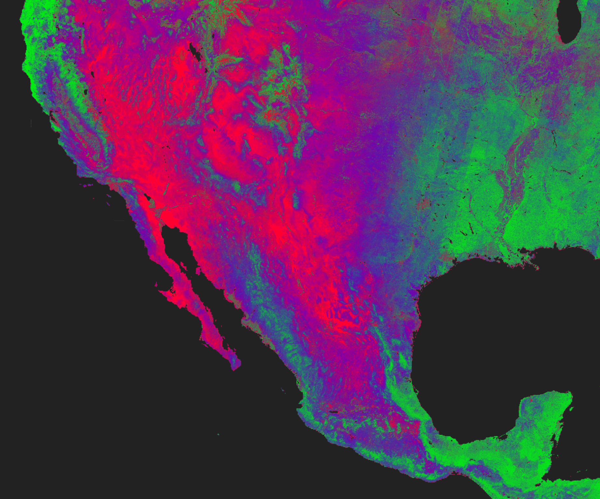

# The Earth Library



<p align="center">
  <em>A global reference library for land cover spectra, and tools for working with it.</em>
</p>


---

**Documentation**: [earth-chris.github.io/earthlib](https://earth-chris.github.io/earthlib)

**Source code**: [earth-chris/earthlib](https://github.com/earth-chris/earthlib)

---

## Introduction

`earthlib` is a spectral library and a set of software tools for satellite-base land cover mapping.

The library contains several thousand unique spectral endmembers representing green vegetation, soil, non-photosynthetic vegetation, urban materials, and burned materials. The reflectance data cover the visible to the shortwave infrared wavelengths (400-2450 nm) at 10 nm band widths.

The software tools (1) resample these data to match the wavelenths of popular satellite and airborne earth observing sensors and (2) run [spectral mixture analysis](docs/introduction.md) in Google Earth Engine via the `earthengine` python package.

The goal is to quantify spatial and temporal patterns of change in global vegetation cover, as well as patterns of soil cover, burned area, non-photosynthetic vegetation, and impervious surfaces. With `earthlib`, you can do this using most public satellite [data sources](docs/sources.md).


## Installation

This library can be installed via `pip`.

```bash
pip install earthlib
```

You can also clone the source repository and install it locally.

```bash
git clone https://github.com/earth-chris/earthlib.git
cd earthlib
pip install -e .
```

### conda

I recommend working with `earthlib` in `conda` (download from [here](https://docs.conda.io/en/latest/miniconda.html)). The `environment.yml` file in this repository contains a series of packages that are either required (`earthengine-api`) or just convenient (`jupyter`, `folium`) to have.

```bash
git clone https://github.com/earth-chris/earthlib.git
cd earthlib
conda env update
```

Once the environment has been created, you can activate it with `conda activate earthlib`.


## Contact


This work is supported by the Stanford Center for Conservation Biology and the Natural Capital Project.
