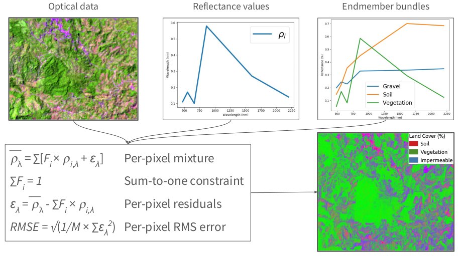

# Spectral Mixture Analysis

The contents of a satellite image pixel are rarely homogeneous. An area 30x30m in size can include buildings, trees, and roads in urban environments; grasses, soils, and char in recently burned landscapes; trees, gaps, and downed logs in forested areas. These patterns all affect the reflectance patterns measured by satellites, and it's important to be able to estimate the sub-pixel abundances of each of these land cover types.

Spectral mixture analysis is an approach to estimating the sub-pixel contents of an image pixel based on a set of representaive reflectance spectra (i.e., a reference library). Linear spectral mixture analysis uses an iterative, least-squares fitting approach to estimate the proportions of land cover types based on observed reflectance measurements. In order to run these analyses, you need 1) a high quality reference library of different land cover types, and 2) to resample these reference data to the wavelengths of the instrument you plan to analyze.

To support these analysise, `earthlib` provides a rich spectral library with thousands of [labeled reference spectra](sources.md) and tools for working with common satellite instruments.
