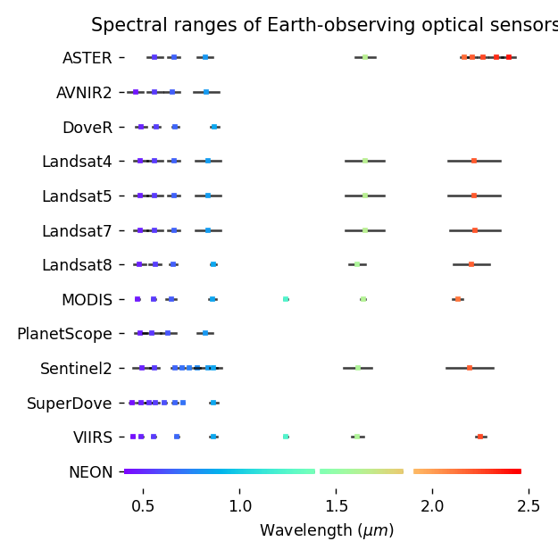
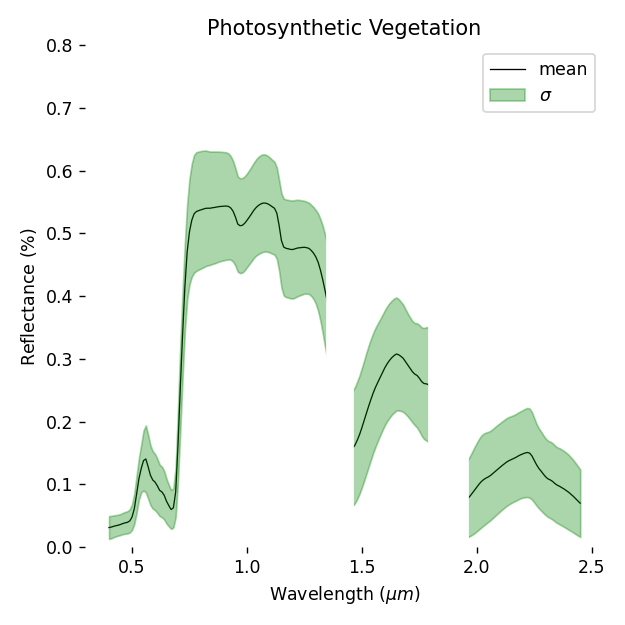
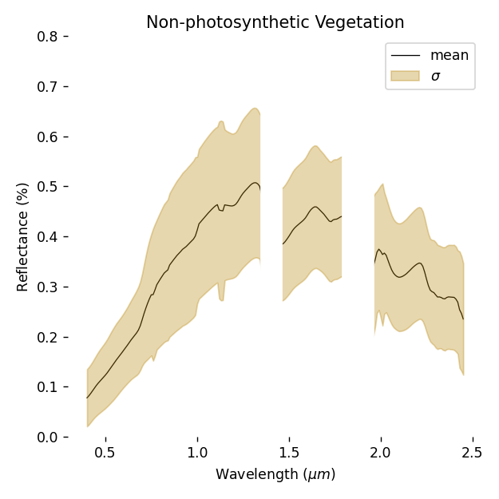
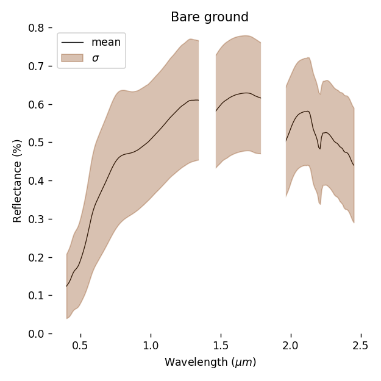
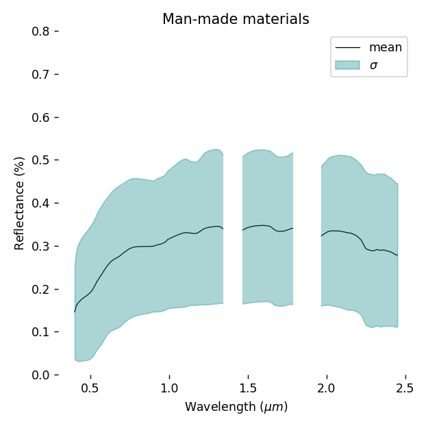

# Data Sources

The Earth Library is a collection of collections, merging spectral measurments and models from a range of raw data sources. `earthlib` provides routines for resampling this collection to match the wavelenghts of the sensors in the series above.

## Spectral Libraries

The following data sources were filtered and resampled prior to inclusion in `earthlib`.

- Vegetation spectra modeled using [PROSAIL](http://teledetection.ipgp.jussieu.fr/prosail/) (using [PyPROSAIL](https://pyprosail.readthedocs.io/en/latest/))
- World Agroforestry (ICRAF) Global [Soil Spectral Library](https://www.worldagroforestry.org/sd/landhealth/soil-plant-spectral-diagnostics-laboratory/soil-spectra-library)
- [The Joint Fire Science Program](https://www.frames.gov/assessing-burn-severity/spectral-library/overview)
- UCSB's [Urban Reflectance Spectra](https://ecosis.org/package/urban-reflectance-spectra-from-santa-barbara--ca)
- UW/BNL/NASA HySPIRI [airborne calibration spectra](https://ecosis.org/package/uw-bnl-nasa-hyspiri-airborne-campaign-leaf-and-canopy-spectra-and-trait-data)
- [USGS Spectral Library Version 7](https://www.sciencebase.gov/catalog/item/5807a2a2e4b0841e59e3a18d)

Below are plots for the primary groups of spectra included in `earthlib`.

